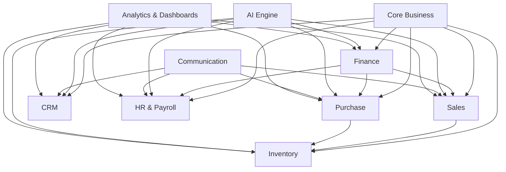

# AICFO — Business Requirements Document (BRD)

---

# Chapter 4 – Business Modules

---

## 4.0 Overview

This chapter defines every **business capability** AICFO must deliver, organized into 10 modules. These are not technical modules or microservices — they represent logical groupings of business functionality from the user's perspective.

Each module includes:
- **Business Purpose** — why this module exists
- **Sub-Capabilities** — what the module does, with descriptions and phase assignments
- **Key Business Rules** — constraints and logic specific to this module
- **AI Interaction** — how the Virtual CFO interacts with this module
- **Dependencies** — which other modules this one relies on

### Phase Legend

| Tag | Meaning | Timeline |
|:----|:--------|:---------|
| **[MVP]** | Minimum Viable Product | Months 1–3 |
| **[P2]** | Phase 2 | Months 4–6 |
| **[P3]** | Phase 3 | Months 7–12 |
| **[P4]** | Phase 4 | Months 13–18+ |

### Module Map

---

## 4.1 Module 1: Core Business

### Business Purpose

Core Business provides the foundational infrastructure on which every other module operates. It handles business identity, organizational structure, user access, financial year management, and platform-wide configuration. Without this module, no other module can function.

### Sub-Capabilities

| # | Capability | Description | Phase |
|:--|:-----------|:------------|:------|
| **4.1.1** | **Business Registration & Profile** | Create a new business on AICFO with: legal name, trade name, business type (Proprietorship, Partnership, LLP, Pvt Ltd, OPC), PAN, GSTIN(s), registered address, contact details, logo upload, and industry classification. | [MVP] |
| **4.1.2** | **Multi-Company Support** | A single user account can own and manage multiple businesses. Each business has completely isolated data (ledger, customers, vendors, inventory, employees). The user switches between businesses from a global selector. | [MVP] |
| **4.1.3** | **Branch / Location Management** | A business can have multiple branches or locations (e.g., "Mumbai Office", "Delhi Warehouse"). Each branch can be a separate GST registration (different GSTIN), a separate cost center for reporting, or both. Transactions can be tagged to a branch. | [P2] |
| **4.1.4** | **Financial Year Management** | Define the business's financial year (default: April 1 – March 31 for India). Support for: creating new financial years, carrying forward opening balances, and locking closed financial years to prevent retroactive entries. | [MVP] |
| **4.1.5** | **Currency Configuration** | Set the base currency for the business (default: INR ₹). Display formatting: Indian numbering system (lakhs, crores) or international (millions, billions). Multi-currency support (foreign currency invoices, exchange rate management) deferred. | [MVP] base, [P3] multi-currency |
| **4.1.6** | **Localization & Language** | Application language (English, Hindi). Number formatting (Indian: 1,00,000 vs International: 100,000). Date format (DD/MM/YYYY for India). Tax regime selection (Indian GST, future: UAE VAT, etc.). | [MVP] English, [P2] Hindi, [P4] regional languages |
| **4.1.7** | **User & Access Management** | Invite users to a business with specific roles (Business Owner, Accountant, Employee, Tax Consultant). Manage permissions per role (RBAC as defined in Chapter 3). Revoke access. View login history. | [MVP] |
| **4.1.8** | **Authentication & Security** | Email + password login. OTP-based mobile login. Google OAuth. Session management. Two-factor authentication (2FA) via authenticator app or SMS OTP. Password reset flow. | [MVP] basic, [P2] 2FA |
| **4.1.9** | **Subscription & Billing** | Manage the business's subscription plan (Free tier, Starter, Professional, Enterprise). Track usage (number of transactions, AI API calls, storage). Handle payment collection (Razorpay/Stripe integration). | [P2] |
| **4.1.10** | **Data Export & Backup** | Export all business data in standard formats: CSV, Excel, JSON, and Tally-compatible XML. Scheduled automatic backups. Data deletion request (GDPR/privacy compliance). | [P2] export, [P3] Tally format |
| **4.1.11** | **Audit Trail (System-Wide)** | Every create, update, delete, and approve action across all modules is logged with: timestamp, actor (user or AI), action type, affected entity, before-state, after-state, and IP address. Audit trail is immutable — entries cannot be edited or deleted. | [MVP] |

### Key Business Rules

| Rule # | Rule |
|:-------|:-----|
| BR-CORE-001 | Every business MUST have at least one user with the Business Owner role. |
| BR-CORE-002 | A user can belong to multiple businesses but has independent roles and permissions in each. |
| BR-CORE-003 | Financial years MUST be continuous — no gaps between years. |
| BR-CORE-004 | A locked financial year cannot have new journal entries unless unlocked by an Accountant or Business Owner (with audit log entry). |
| BR-CORE-005 | All timestamps MUST be stored in UTC and displayed in the user's local timezone (default: IST for Indian businesses). |
| BR-CORE-006 | Business deletion is a soft-delete with 30-day grace period. Data is permanently purged only after 30 days and explicit confirmation. |
| BR-CORE-007 | Super Admin cannot access any tenant's financial data — enforced at the database level through row-level security. |

### AI Interaction

| AI Capability | Description |
|:--------------|:------------|
| Onboarding wizard | AI guides the business owner through initial setup: "What's your business name? What type of business is it? What's your GSTIN?" — via conversational flow instead of forms. |
| Smart defaults | AI pre-configures Chart of Accounts, tax rates, and financial year based on business type and industry. |

### Dependencies

None — Core Business is the foundational module. All other modules depend on it.

---

## 4.2 Module 2: Finance

### Business Purpose

Finance is the **heart of AICFO**. It manages the double-entry accounting ledger, chart of accounts, journal entries, bank reconciliation, and all financial statements. Every transaction from every other module (Sales, Purchase, Inventory, HR) ultimately flows into Finance as journal entries.

### Sub-Capabilities

| # | Capability | Description | Phase |
|:--|:-----------|:------------|:------|
| **4.2.1** | **Chart of Accounts (COA)** | A hierarchical tree of accounts organized by type: Assets, Liabilities, Equity, Income, Expenses. Each account has: code, name, type, sub-type, parent account, description, GST applicability, and active/inactive status. AICFO provides industry-specific default COA templates (Trading, Services, Manufacturing). | [MVP] |
| **4.2.2** | **Account Groups & Sub-Groups** | Accounts can be organized into groups and sub-groups for reporting. Standard Indian groups: Current Assets, Fixed Assets, Current Liabilities, Long-Term Liabilities, Direct Income, Indirect Income, Direct Expenses, Indirect Expenses, etc. | [MVP] |
| **4.2.3** | **Journal Entries** | The fundamental unit of accounting. Every journal entry contains: date, entry number (auto-generated), narration, one or more debit lines, one or more credit lines (total debits MUST equal total credits), reference document (invoice, bill, receipt), source (Manual, Voice, AI, OCR, System), confidence score (if AI-generated), and approval status. | [MVP] |
| **4.2.4** | **Journal Entry Types** | Predefined voucher types that map to common business transactions: Sales Entry, Purchase Entry, Receipt (money in), Payment (money out), Contra (bank-to-cash transfers), Journal Proper (adjustments), Opening Balance, Depreciation, and Tax Payment. | [MVP] |
| **4.2.5** | **General Ledger** | Account-wise chronological listing of all journal entries affecting that account, with running balance. Supports date-range filtering, account filtering, and drill-down to source document. | [MVP] |
| **4.2.6** | **Trial Balance** | Report showing all accounts with their debit and credit balances at a point in time. Total debits MUST equal total credits. Supports period-based comparison (this month vs last month, this year vs last year). | [MVP] |
| **4.2.7** | **Profit & Loss Statement** | Income minus Expenses for a given period. Supports: monthly, quarterly, yearly views. Comparative P&L (current period vs previous period). Percentage analysis (each line as % of revenue). | [MVP] |
| **4.2.8** | **Balance Sheet** | Assets, Liabilities, and Equity at a point in time. MUST satisfy: Assets = Liabilities + Equity. Includes current and non-current classifications. | [MVP] |
| **4.2.9** | **Cash Flow Statement** | Cash inflows and outflows categorized by: Operating Activities, Investing Activities, and Financing Activities. Derived from ledger entries tagged with cash flow categories. | [P2] |
| **4.2.10** | **Bank Reconciliation** | Upload bank statement (CSV/Excel/PDF). AICFO auto-matches bank transactions with ledger entries by amount, date, and reference. Unmatched entries are flagged for manual review. Reconciliation status tracked per bank account. | [P2] |
| **4.2.11** | **Fixed Asset Register** | Track capital assets: acquisition date, cost, location, depreciation method (SLM or WDV), depreciation rate (per Income Tax Act Section 32), accumulated depreciation, written-down value, and disposal. Auto-generate monthly/yearly depreciation entries. | [P2] |
| **4.2.12** | **Cost Centers** | Tag transactions to cost centers (departments, projects, branches) for management reporting. P&L and expense reports can be filtered by cost center. | [P2] |
| **4.2.13** | **Budgeting** | Define annual or monthly budgets per account or account group. Track actual vs budget with variance analysis. AI alerts when spending exceeds budget thresholds. | [P3] |
| **4.2.14** | **Multi-Currency Transactions** | Record transactions in foreign currencies. Maintain exchange rates. Automatically calculate exchange gains/losses on settlement. | [P3] |
| **4.2.15** | **Opening Balances** | Enter opening balances for all accounts when starting AICFO mid-year or migrating from another system. AI assists by reading Tally/Excel exports and mapping to COA. | [MVP] |
| **4.2.16** | **Period Closing** | Lock a month or financial year so no new entries can be posted. Generate closing entries (transfer income/expense to retained earnings). Carry forward balances to the next period. | [MVP] (manual), [P2] (automated) |

### Key Business Rules

| Rule # | Rule |
|:-------|:-----|
| BR-FIN-001 | Every journal entry MUST balance — total debits MUST equal total credits. The system MUST reject imbalanced entries. |
| BR-FIN-002 | Journal entries cannot be deleted. They can only be **reversed** by creating a counter-entry. The original entry and reversal are linked in the audit trail. |
| BR-FIN-003 | Entries in a locked period cannot be created or modified unless the period is explicitly unlocked by an authorized user (Accountant or Owner). |
| BR-FIN-004 | The system MUST maintain referential integrity — deleting a customer, vendor, or product does not delete associated journal entries. Entities are archived, not deleted. |
| BR-FIN-005 | Depreciation entries are system-generated based on the Fixed Asset Register schedule. They SHOULD be reviewed by the Accountant before period closing. |
| BR-FIN-006 | Bank reconciliation differences MUST be tracked and reported. The system MUST NOT auto-create entries to force reconciliation. |
| BR-FIN-007 | Opening balance entries MUST be made to a dedicated Opening Balance Equity account to ensure the trial balance remains balanced during migration. |
| BR-FIN-008 | All monetary amounts MUST be stored with precision of 2 decimal places (paisa). GST calculations MUST round to the nearest paisa using standard rounding rules. |

### AI Interaction

| AI Capability | Description |
|:--------------|:------------|
| Voice-to-journal | Owner speaks a transaction → AI creates a complete journal entry with correct debit/credit accounts, amount, and GST treatment |
| Account suggestion | AI learns which accounts the business frequently uses and suggests them contextually. "Paid rent" → AI maps to "Rent Expense" account. |
| Anomaly detection | AI flags unusual entries: duplicate amounts, unusual account combinations, entries significantly larger than historical patterns. |
| Auto-depreciation | AI schedules and posts depreciation entries automatically based on asset register. |
| Report generation | "Show me this month's P&L" → AI generates and reads out the report. |

### Dependencies

- **Core Business** — business context, financial year, user permissions

---

## 4.3 Module 3: Sales

### Business Purpose

Sales manages the complete revenue cycle — from customer relationships to quotation, order, invoicing, payment collection, and credit notes. Every sales transaction generates corresponding Finance journal entries automatically.

### Sub-Capabilities

| # | Capability | Description | Phase |
|:--|:-----------|:------------|:------|
| **4.3.1** | **Customer Master** | Create and manage customer profiles: name, GSTIN, PAN, billing address, shipping address, contact persons, payment terms (e.g., Net 30), credit limit, and customer group classification. | [MVP] |
| **4.3.2** | **Quotation / Estimate** | Create a price quotation for a customer with: line items (product/service, HSN/SAC code, quantity, rate, discount, GST), terms & conditions, validity period, and conversion to Sales Order. | [P2] |
| **4.3.3** | **Sales Order** | Formalize a customer's confirmed order. Tracks order status (Pending, Partially Fulfilled, Fulfilled, Cancelled). Links to downstream invoice and delivery. | [P2] |
| **4.3.4** | **Sales Invoice** | GST-compliant invoice generation with: sequential invoice numbering, customer details with GSTIN, line items with HSN/SAC codes, tax breakdown (CGST/SGST or IGST based on Place of Supply), total with tax, payment terms, and bank details. Supports PDF generation and email/WhatsApp delivery. | [MVP] |
| **4.3.5** | **E-Invoicing** | Generate IRN (Invoice Registration Number) by integrating with GSTN's e-Invoice portal. Mandatory for businesses with turnover > ₹5 crore. Includes QR code on invoice. | [P3] |
| **4.3.6** | **Payment Receipt** | Record payments received against invoices. Supports: full payment, partial payment, advance payment. Payment modes: Cash, Bank Transfer (NEFT/RTGS/IMPS), UPI, Cheque, Credit Card. Auto-generates receipt voucher journal entry. | [MVP] |
| **4.3.7** | **Credit Note** | Issue credit notes for sales returns, pricing corrections, or discount adjustments. Links to original invoice. Adjusts GST liability. Updates customer outstanding balance. | [P2] |
| **4.3.8** | **Accounts Receivable Aging** | Report showing outstanding customer invoices categorized by age: Current, 1–30 days, 31–60 days, 61–90 days, 90+ days overdue. Highlights overdue invoices for follow-up. | [MVP] |
| **4.3.9** | **Customer Statement** | Generate a statement of account for a customer showing all invoices, payments, credit notes, and outstanding balance for a given period. Can be sent to the customer. | [P2] |
| **4.3.10** | **Recurring Invoices** | Set up auto-generated invoices for subscription or retainer customers (e.g., monthly maintenance contract). AI suggests recurring patterns based on historical invoicing. | [P3] |

### Key Business Rules

| Rule # | Rule |
|:-------|:-----|
| BR-SALE-001 | Invoice numbers MUST be sequential within a financial year. Gaps in numbering are flagged for audit purposes. |
| BR-SALE-002 | GST Place of Supply rules MUST be enforced: if customer's state matches business's state → CGST + SGST. If different → IGST. |
| BR-SALE-003 | A posted invoice cannot be edited. Corrections MUST be made via Credit Note. |
| BR-SALE-004 | Payment receipt MUST be matched to one or more invoices. Unmatched payments are recorded as "Advance from Customer" until allocated. |
| BR-SALE-005 | Credit notes MUST reference the original invoice. Credit note amount cannot exceed the original invoice amount. |
| BR-SALE-006 | Customer credit limit (if set) triggers a warning when a new invoice would exceed it. The warning does not block the invoice but requires explicit acknowledgment. |

### AI Interaction

| AI Capability | Description |
|:--------------|:------------|
| Voice invoicing | "Create an invoice for ABC Company for 10 laptops at ₹50,000 each" → AI creates complete invoice with GST |
| Payment recording | "ABC Company paid ₹3,50,000 by bank transfer" → AI matches to open invoice and records receipt |
| Overdue alerts | AI proactively notifies: "ABC Company's invoice #INV-2026-0142 is 15 days overdue. ₹4,80,000 outstanding. Shall I send a reminder?" |
| Customer insights | "How much did ABC Company buy this year?" → AI queries and responds |

### Dependencies

- **Core Business** — business context, GSTIN, place of supply
- **Finance** — journal entries for sales, receipts, and credit notes
- **Inventory** — stock deduction on invoicing (if inventory-tracked items)
- **Communication** — invoice delivery via email/WhatsApp

---

## 4.4 Module 4: Purchase

### Business Purpose

Purchase manages the complete procurement cycle — from vendor relationships to purchase orders, bill recording, expense tracking, and vendor payments. Every purchase transaction generates Finance journal entries including GST Input Tax Credit.

### Sub-Capabilities

| # | Capability | Description | Phase |
|:--|:-----------|:------------|:------|
| **4.4.1** | **Vendor Master** | Create and manage vendor profiles: name, GSTIN, PAN, address, contact persons, payment terms, TDS applicability, and vendor classification. | [MVP] |
| **4.4.2** | **Purchase Order (PO)** | Create formal purchase orders to vendors with: line items, quantities, rates, expected delivery date, terms. Track PO status (Sent, Acknowledged, Received, Closed). | [P2] |
| **4.4.3** | **Purchase Bill / Invoice** | Record vendor bills/invoices: vendor details, bill number, bill date, due date, line items with HSN/SAC, GST treatment (ITC eligible or not), TDS applicability and deduction. Supports manual entry, voice entry, and OCR scan. | [MVP] |
| **4.4.4** | **Expense Recording** | Quick expense entry for non-PO purchases: "Paid ₹4,500 for office supplies." Supports: voice input, receipt photo, manual form. Auto-classifies expense category. | [MVP] |
| **4.4.5** | **Vendor Payment** | Record payments made to vendors. Supports: full payment, partial payment, advance payment. Payment modes: Cash, Bank Transfer, UPI, Cheque. TDS auto-deducted if applicable. Generates payment voucher journal entry. | [MVP] |
| **4.4.6** | **Debit Note** | Issue debit notes for purchase returns or pricing disputes. Links to original bill. Adjusts GST ITC. Updates vendor balance. | [P2] |
| **4.4.7** | **Accounts Payable Aging** | Report showing outstanding vendor bills categorized by age: Current, 1–30 days, 31–60 days, 61–90 days, 90+ days overdue. | [MVP] |
| **4.4.8** | **TDS Management** | Auto-detect TDS applicability based on payment type and threshold (Section 194C, 194I, 194J, etc.). Calculate TDS amount. Track TDS deducted, deposited, and pending. Generate TDS certificates (Form 16A). | [P3] |
| **4.4.9** | **Recurring Expenses** | Set up recurring expense entries (monthly rent, subscriptions, insurance premiums). AI suggests automation based on historical patterns. | [P3] |
| **4.4.10** | **Vendor Statement** | Generate a statement of account for a vendor showing all bills, payments, debit notes, and outstanding balance. | [P2] |

### Key Business Rules

| Rule # | Rule |
|:-------|:-----|
| BR-PUR-001 | GST Input Tax Credit (ITC) MUST only be claimed for vendors with valid GSTIN. Purchases from unregistered vendors are recorded without ITC. |
| BR-PUR-002 | TDS MUST be deducted when payment to a vendor exceeds the threshold specified under the relevant Income Tax Act section. |
| BR-PUR-003 | ITC eligibility MUST be verified against GSTR-2B data (when integration is available). ITC on blocked categories (e.g., motor vehicles for non-transport businesses) MUST be flagged. |
| BR-PUR-004 | Vendor payments MUST be matched to one or more bills. Unmatched payments are recorded as "Advance to Vendor." |
| BR-PUR-005 | Reverse Charge Mechanism (RCM) transactions MUST be identified and GST liability recorded on the buyer (business) side. |

### AI Interaction

| AI Capability | Description |
|:--------------|:------------|
| Voice expense | "Paid ₹4,500 to Ravi Stationery for office supplies, cash" → AI creates expense with vendor, category, GST ITC |
| Receipt OCR | Owner photographs a vendor bill → AI extracts vendor name, GSTIN, amounts, line items, GST, and creates the purchase entry |
| TDS detection | AI detects: "This payment to your landlord exceeds ₹2,40,000 for the year. TDS of ₹24,000 (10%) should be deducted. Shall I apply it?" |
| Duplicate detection | AI warns: "This bill looks similar to one recorded 3 days ago from the same vendor for the same amount. Is this a duplicate?" |

### Dependencies

- **Core Business** — business context, GSTIN
- **Finance** — journal entries for purchases, payments, and TDS
- **Inventory** — stock addition on bill receipt (if inventory-tracked items)

---

## 4.5 Module 5: Inventory

### Business Purpose

Inventory manages products, stock levels, warehouses, and stock movements. It connects to Sales (stock reduction on invoicing) and Purchase (stock addition on bill receipt) to maintain accurate, real-time inventory records.

### Sub-Capabilities

| # | Capability | Description | Phase |
|:--|:-----------|:------------|:------|
| **4.5.1** | **Product / Item Master** | Create products with: name, SKU, HSN/SAC code, unit of measurement, selling price, purchase price, GST rate, category, description, and image. Supports goods and services. | [P2] |
| **4.5.2** | **Warehouse / Location** | Define storage locations. Each warehouse has a name, address, and associated branch. Stock is tracked per warehouse. | [P2] |
| **4.5.3** | **Stock-In (Purchase to Stock)** | When a purchase bill is recorded for an inventory item, stock quantity automatically increases at the receiving warehouse. | [P2] |
| **4.5.4** | **Stock-Out (Sales to Stock)** | When a sales invoice is created for an inventory item, stock quantity automatically decreases. If insufficient stock, system warns but allows (configurable: warn vs block). | [P2] |
| **4.5.5** | **Stock Transfer** | Move stock between warehouses. Creates a transfer voucher documenting: from warehouse, to warehouse, items, quantities, date, and reason. | [P3] |
| **4.5.6** | **Stock Adjustment** | Manual adjustment for damaged goods, theft, samples, or physical count discrepancies. Requires reason and creates a journal entry for inventory write-off if value is affected. | [P2] |
| **4.5.7** | **Stock Valuation** | Calculate stock value using FIFO (First In First Out) or Weighted Average Cost. Valuation method is set per product and affects Cost of Goods Sold (COGS) in P&L. | [P2] |
| **4.5.8** | **Low Stock Alerts** | Define reorder levels per product. AI alerts when stock falls below threshold: "Laptop stock is down to 3 units. Average monthly sales: 15 units. Shall I draft a PO to Dell?" | [P3] |
| **4.5.9** | **Stock Reports** | Stock summary, stock movement register, stock aging, and stock valuation reports. | [P2] |

### Key Business Rules

| Rule # | Rule |
|:-------|:-----|
| BR-INV-001 | Stock quantities MUST be non-negative unless the business explicitly enables negative stock (configurable per warehouse). |
| BR-INV-002 | Stock valuation method (FIFO or Weighted Average) MUST be consistent for a product within a financial year. Changes require year-end adjustment. |
| BR-INV-003 | Stock adjustments MUST have a documented reason and MUST create a corresponding journal entry if they affect inventory value. |
| BR-INV-004 | Products linked to invoices or bills MUST NOT be deleted. They can only be marked inactive. |

### AI Interaction

| AI Capability | Description |
|:--------------|:------------|
| Voice stock check | "How many laptops do we have in stock?" → AI responds with quantity per warehouse |
| Smart reorder | AI learns consumption patterns and proactively suggests reorders |
| Voice stock movement | "Received 50 boxes of paper from XYZ Supplies" → AI creates purchase entry + stock-in |

### Dependencies

- **Core Business** — warehouses map to branches
- **Finance** — COGS, inventory valuation, stock write-offs
- **Sales** — stock-out on invoicing
- **Purchase** — stock-in on bill receipt

---

## 4.6 Module 6: CRM (Customer Relationship Management)

### Business Purpose

CRM manages the pre-sale pipeline — leads, opportunities, contacts, and follow-up activities. It feeds the Sales module by converting opportunities into quotations and orders. For many SMBs, CRM is the first module that drives revenue growth.

### Sub-Capabilities

| # | Capability | Description | Phase |
|:--|:-----------|:------------|:------|
| **4.6.1** | **Lead Management** | Capture leads from multiple sources (manual entry, website form, WhatsApp, email). Each lead has: name, company, contact info, source, status (New, Contacted, Qualified, Unqualified), and assigned owner. | [P2] |
| **4.6.2** | **Opportunity Pipeline** | Convert qualified leads into opportunities with: expected deal value, probability, expected close date, products/services of interest, and pipeline stage (Prospecting, Proposal, Negotiation, Closed Won, Closed Lost). | [P3] |
| **4.6.3** | **Contact Management** | Maintain a directory of business contacts (customers, potential customers, partners) with: name, designation, company, phone, email, and communication history. | [P2] |
| **4.6.4** | **Activity Logging** | Log interactions with leads and contacts: phone calls, meetings, emails, WhatsApp messages, notes. Each activity has: type, date, summary, next action, and follow-up date. | [P2] |
| **4.6.5** | **Follow-Up Reminders** | Automated reminders for scheduled follow-ups. AI suggests follow-up timing based on lead engagement patterns. Push notification and email reminders. | [P3] |
| **4.6.6** | **Lead-to-Customer Conversion** | When a lead converts (deal won), automatically create a Customer record in the Sales module with all captured information pre-filled. | [P3] |

### Key Business Rules

| Rule # | Rule |
|:-------|:-----|
| BR-CRM-001 | Every lead MUST have an assigned owner (user) responsible for follow-up. |
| BR-CRM-002 | Lead status transitions MUST be logged in the activity history. |
| BR-CRM-003 | Opportunity pipeline reports MUST show weighted value (deal value × probability). |
| BR-CRM-004 | Stale leads (no activity for 30+ days) MUST be flagged automatically. |

### AI Interaction

| AI Capability | Description |
|:--------------|:------------|
| Voice lead creation | "Got a new lead — Priya from MegaCorp, interested in 50 laptops, phone number 98765..." → AI creates lead |
| Follow-up coaching | AI reminds: "You haven't followed up with MegaCorp in 12 days. Their interest level was high. Shall I schedule a call?" |
| Pipeline summary | "How's my sales pipeline looking?" → AI summarizes total value, win probability, and expected closes this month |

### Dependencies

- **Core Business** — user assignments, access control
- **Sales** — lead-to-customer conversion, quotation creation
- **Communication** — follow-up via email/WhatsApp/SMS

---

## 4.7 Module 7: HR & Payroll

### Business Purpose

HR manages the employee lifecycle — from hiring to attendance, leave, payroll processing, and reimbursements. Payroll is a significant accounting event that generates journal entries for salary expenses, tax deductions (TDS, PF, ESI), and bank payments.

### Sub-Capabilities

| # | Capability | Description | Phase |
|:--|:-----------|:------------|:------|
| **4.7.1** | **Employee Master** | Create employee profiles: name, designation, department, date of joining, salary structure (basic, HRA, special allowances), bank account details, PAN, Aadhaar, PF number, ESI number, and emergency contact. | [P3] |
| **4.7.2** | **Attendance Tracking** | Record daily attendance (Present, Absent, Half-Day, Leave, Holiday, Weekend). Supports manual entry, biometric integration (future), and mobile check-in/check-out. | [P3] |
| **4.7.3** | **Leave Management** | Define leave types (Casual, Sick, Earned, Maternity, etc.) with annual quotas. Employees request leave → Owner/Manager approves/rejects. Track leave balance. Carry-forward and encashment rules. | [P3] |
| **4.7.4** | **Payroll Processing** | Monthly payroll calculation: Gross Salary – Deductions (PF employee share, ESI employee share, TDS, Professional Tax, LOP deductions) = Net Pay. Generate payslips. Create salary payment journal entries (Salary Expense Dr, TDS Payable Cr, PF Payable Cr, Bank Cr). | [P3] |
| **4.7.5** | **Statutory Compliance** | Calculate employer contributions: PF employer share (12%), ESI employer share (3.25%). Generate PF/ESI challan data. Calculate TDS on salary per income tax slab. | [P3] |
| **4.7.6** | **Reimbursement Claims** | Employees submit expense claims (travel, meals, phone, etc.) with receipts. Owner approves/rejects. Approved claims are paid in the next payroll cycle or as ad-hoc payments. | [P3] |
| **4.7.7** | **Payslip & Form 16** | Generate monthly payslips showing earnings, deductions, and net pay. Generate annual Form 16 (TDS certificate) for each employee. | [P3] |

### Key Business Rules

| Rule # | Rule |
|:-------|:-----|
| BR-HR-001 | Payroll MUST be processed only once per month per employee. Re-processing (for corrections) creates a supplementary payslip linked to the original. |
| BR-HR-002 | TDS on salary MUST be calculated based on the employee's projected annual income and applicable tax slab, averaged across remaining months. |
| BR-HR-003 | PF and ESI calculations MUST comply with current rates published by EPFO and ESIC respectively. |
| BR-HR-004 | Leave without pay (LOP) MUST automatically reduce the pro-rata salary in that month's payroll. |
| BR-HR-005 | Employee personal information (Aadhaar, PAN, bank details) MUST be encrypted at rest and accessible only to authorized roles. |

### AI Interaction

| AI Capability | Description |
|:--------------|:------------|
| Voice payroll | "Paid salary to Rahul" → AI creates salary expense journal entry based on Rahul's salary structure |
| Payroll summary | "What's this month's total payroll cost?" → AI calculates and responds including employer contributions |
| Leave query | Employee asks: "How much leave do I have left?" → AI retrieves and responds |

### Dependencies

- **Core Business** — employee-to-branch mapping, access control
- **Finance** — salary expense journal entries, TDS/PF/ESI liability accounts
- **Communication** — payslip delivery via email

---

## 4.8 Module 8: AI Engine

### Business Purpose

The AI Engine is what makes AICFO fundamentally different from traditional accounting software. It provides the conversational interface, natural language understanding, transaction extraction, confidence scoring, memory, learning, and advisory capabilities that enable voice-first bookkeeping.

> **Note:** This module's detailed behavioral requirements are further elaborated in **Chapter 11 – AI Business Requirements** and **Chapter 13 – AI Conversation Catalog**. This section defines the capability map.

### Sub-Capabilities

| # | Capability | Description | Phase |
|:--|:-----------|:------------|:------|
| **4.8.1** | **AI Bookkeeper** | Core capability: understand spoken or typed business transactions and convert them into structured journal entries. Handles: intent detection (sale, expense, payment, asset purchase, salary), entity extraction (customer, vendor, employee, product, amount, date), account classification, GST treatment, and payment channel identification. | [MVP] |
| **4.8.2** | **AI Clarification Engine** | When the AI cannot fully extract all required fields, it initiates a multi-turn clarification dialogue: asks follow-up questions, presents quick-response options, and assembles the complete transaction from the conversation. | [MVP] |
| **4.8.3** | **AI Confidence Scoring** | Every AI-extracted field has a confidence score (0.0–1.0). The aggregate entry confidence determines whether the entry is auto-posted, queued for owner confirmation, or queued for accountant review (per the escalation model in Chapter 3, Section 3.11). | [MVP] |
| **4.8.4** | **AI Accountant (Review Assistant)** | Assists the Accountant role by: presenting low-confidence entries for review, suggesting corrections, explaining why certain classifications were chosen, and flagging anomalies in the ledger. | [P2] |
| **4.8.5** | **AI CFO (Advisory)** | Strategic financial advisory: answers questions like "Can I afford to buy X?", "What's my cash runway?", "Should I hire another employee?". Analyzes cash flow, profit trends, receivables/payables, and provides data-backed recommendations. | [MVP] (basic), [P3] (advanced) |
| **4.8.6** | **AI Memory** | The AI maintains per-business memory: frequently used vendors, recurring transaction patterns, preferred account classifications, corrected mappings, and seasonal trends. Memory improves accuracy over time and enables proactive suggestions. | [P2] |
| **4.8.7** | **AI Learning from Corrections** | When a user corrects an AI-generated entry (changes account, vendor, category, or amount), the correction is logged as training signal. The AI uses these corrections to improve future accuracy for that specific business. | [MVP] (logging), [P2] (active learning) |
| **4.8.8** | **AI Insights** | Proactive business intelligence: "Your marketing spend increased 40% this month but revenue didn't grow proportionally", "Customer XYZ's payment pattern has shifted from 15-day to 45-day", "Your electricity costs are 20% higher than Q1". | [P3] |
| **4.8.9** | **AI Forecasting** | Predictive financial modeling: revenue forecast based on historical trends, cash flow projection for next 3–6 months, tax liability estimation for the quarter/year, and seasonal demand prediction for inventory. | [P4] |
| **4.8.10** | **AI Voice Pipeline** | End-to-end voice processing: microphone capture → speech-to-text (Whisper) → NLP extraction → response generation → text-to-speech (TTS) output. Supports real-time streaming and offline voice note queuing. | [MVP] |
| **4.8.11** | **AI OCR Pipeline** | Document intelligence: camera/upload capture → image preprocessing → OCR text extraction → structured data parsing (vendor, GSTIN, line items, amounts, taxes) → ledger entry creation. | [MVP] (basic), [P2] (advanced) |
| **4.8.12** | **AI Audit Trail** | Every AI decision is logged: input received, interpretation made, confidence scores per field, final extraction, user confirmation/correction, and model version used. This trail is critical for debugging, compliance, and continuous improvement. | [MVP] |

### Key Business Rules

| Rule # | Rule |
|:-------|:-----|
| BR-AI-001 | AI MUST NOT auto-post any entry with aggregate confidence below 0.85 without human confirmation (configurable threshold). |
| BR-AI-002 | AI MUST present its extraction to the user before creating a journal entry. "Silent" bookkeeping is not permitted in MVP. |
| BR-AI-003 | AI corrections MUST be logged with both the original AI output and the user's correction, preserving the training signal. |
| BR-AI-004 | AI MUST NOT access or learn from one business's data to improve another business's predictions. Learning is strictly per-tenant. |
| BR-AI-005 | AI advisory responses MUST include disclaimers that they are AI-generated and should not be treated as professional financial advice. |
| BR-AI-006 | AI memory and learned patterns MUST be exportable and deletable by the business owner (data ownership principle). |
| BR-AI-007 | The AI pipeline MUST have a fallback mode: if the AI API is unavailable, users can still enter transactions manually via forms. |

### Dependencies

- **All modules** — AI interacts with every module in the system
- **Core Business** — tenant context, user identity, language preference
- **Finance** — AI creates journal entries in the Finance module

---

## 4.9 Module 9: Communication

### Business Purpose

Communication handles all outbound messaging from AICFO to external parties (customers, vendors, employees) and system notifications to users. It serves as the delivery layer for invoices, payment reminders, alerts, and reports.

### Sub-Capabilities

| # | Capability | Description | Phase |
|:--|:-----------|:------------|:------|
| **4.9.1** | **Email** | Send transactional emails: invoices, quotations, payment receipts, payment reminders, payslips. Custom email templates with business branding. Track open/delivery status. | [MVP] |
| **4.9.2** | **SMS** | Send SMS notifications for: payment reminders, OTP for login, critical alerts (low cash balance, large transaction). Short, actionable messages. | [P2] |
| **4.9.3** | **WhatsApp Business API** | Send messages via WhatsApp: invoice PDFs, payment reminders, payment confirmation, and interactive quick-reply buttons. Receive incoming messages for basic commands (e.g., customer replying "Paid" to a reminder). | [P3] |
| **4.9.4** | **Push Notifications** | Mobile app push notifications for: AI-generated entries requiring confirmation, daily briefing, overdue invoice alerts, low stock alerts, payroll due, GST filing deadline. | [MVP] (basic), [P2] (rich) |
| **4.9.5** | **In-App Notifications** | Notification center within the web/mobile app showing all system events, AI alerts, and pending actions. Mark as read, snooze, or take action. | [MVP] |
| **4.9.6** | **Notification Preferences** | Users can configure which notifications they receive and via which channel (email, SMS, WhatsApp, push, in-app). Supports frequency settings (immediate, daily digest, weekly digest). | [P2] |
| **4.9.7** | **Template Management** | Customizable message templates for invoices, reminders, and alerts. Variables (customer name, amount, due date) auto-populated. Multi-language support (English, Hindi). | [P2] |

### Key Business Rules

| Rule # | Rule |
|:-------|:-----|
| BR-COM-001 | Invoice emails MUST include the invoice PDF as an attachment and key details (amount, due date) in the email body. |
| BR-COM-002 | Payment reminder frequency MUST be configurable: default is Day 1 (due date), Day 7, Day 15, Day 30 after due date. |
| BR-COM-003 | SMS and WhatsApp messages MUST comply with TRAI DND (Do Not Disturb) regulations. Marketing messages are not sent to DND-registered numbers. |
| BR-COM-004 | All outbound communications MUST be logged with: channel, recipient, timestamp, content hash, and delivery status. |

### Dependencies

- **Sales** — invoice delivery, payment reminders
- **Purchase** — PO delivery to vendors
- **HR** — payslip delivery
- **Core Business** — user notification preferences

---

## 4.10 Module 10: Analytics & Dashboards

### Business Purpose

Analytics provides visual dashboards, reports, KPI tracking, and data visualizations that turn raw ledger data into actionable business intelligence. This is the "glass cockpit" that gives business owners real-time visibility without needing to read accounting reports.

### Sub-Capabilities

| # | Capability | Description | Phase |
|:--|:-----------|:------------|:------|
| **4.10.1** | **Executive Dashboard** | Single-screen overview showing: today's/this month's revenue, expenses, net profit, bank balance, accounts receivable, accounts payable, GST liability, and cash runway. Visual cards with trend indicators (▲▼). | [MVP] |
| **4.10.2** | **Revenue Analytics** | Revenue by: customer, product/service, month/quarter, branch. Trends, comparisons (this month vs last month, this year vs last year). Top 10 customers by revenue. | [MVP] |
| **4.10.3** | **Expense Analytics** | Expense breakdown by: category, vendor, month/quarter, branch. Identification of top expense categories. Month-over-month trend analysis. | [MVP] |
| **4.10.4** | **Cash Flow Dashboard** | Visual cash flow: inflows vs outflows over time. Current bank balance. Projected cash position (based on pending receivables and payables). Cash runway in months. | [P2] |
| **4.10.5** | **GST Dashboard** | Monthly GST summary: Output tax collected, Input tax credit claimed, Net payable/refundable. Filing status (filed/pending). GSTR-2B reconciliation status. | [P2] |
| **4.10.6** | **Inventory Dashboard** | Stock levels, low-stock alerts, stock value, fast-moving vs slow-moving items, stock turnover ratio. | [P2] |
| **4.10.7** | **CRM Dashboard** | Lead pipeline visualization, conversion rates, deal value by stage, activities due today, stale leads. | [P3] |
| **4.10.8** | **HR Dashboard** | Headcount, payroll cost trend, leave balance summary, attendance overview, reimbursement pending. | [P3] |
| **4.10.9** | **AI Performance Dashboard** | AI accuracy metrics: extraction accuracy rate, average confidence score, correction rate, most-corrected field types, processing time P50/P95. Available to Business Owner and Accountant. | [P2] |
| **4.10.10** | **Custom Reports** | User-defined reports with: date range, account filters, grouping (by customer, vendor, category, branch), and export to PDF/Excel/CSV. | [P3] |
| **4.10.11** | **KPI Tracking** | Define business KPIs (gross margin %, customer acquisition cost, average payment cycle, inventory turnover). Track actuals vs targets with visual gauges. AI alerts when KPIs deviate from targets. | [P3] |
| **4.10.12** | **Comparative Analysis** | Period-over-period comparison: this month vs last month, this quarter vs same quarter last year. Branch-vs-branch comparison. Variance analysis. | [P2] |

### Key Business Rules

| Rule # | Rule |
|:-------|:-----|
| BR-ANA-001 | Dashboard data MUST refresh in real-time (within 5 seconds of a transaction being posted). |
| BR-ANA-002 | All monetary values in dashboards MUST match the underlying ledger data exactly. Dashboards are views, not separate data stores. |
| BR-ANA-003 | Report exports MUST include generation timestamp, business name, and period covered. |
| BR-ANA-004 | Dashboard access respects RBAC — employees see only their own data; business owners see everything. |

### AI Interaction

| AI Capability | Description |
|:--------------|:------------|
| Voice reports | "Show me this month's profit" → AI generates and speaks the P&L summary |
| Anomaly highlighting | Dashboard cards glow or pulse when values are unusual (e.g., expense spike, revenue drop) |
| Natural language queries | "Which customer bought the most this quarter?" → AI queries and responds |
| Morning briefing source | The Virtual CFO's morning briefing is assembled from Analytics module data |

### Dependencies

- **All modules** — Analytics aggregates data from every module
- **Finance** — primary data source for financial dashboards
- **AI Engine** — natural language query processing

---

## 4.11 Module Phase Summary

The following table summarizes all sub-capabilities organized by release phase:

### MVP (Months 1–3) — 28 capabilities

| Module | Capabilities |
|:-------|:-------------|
| Core Business | Business Profile, Multi-Company, Financial Year, Currency (INR), Localization (English), User Management, Authentication, Audit Trail |
| Finance | Chart of Accounts, Journal Entries, Entry Types, General Ledger, Trial Balance, P&L, Balance Sheet, Opening Balances, Period Closing (manual) |
| Sales | Customer Master, Sales Invoice, Payment Receipt, AR Aging |
| Purchase | Vendor Master, Purchase Bill, Expense Recording, Vendor Payment, AP Aging |
| AI Engine | AI Bookkeeper, Clarification Engine, Confidence Scoring, AI CFO (basic), Voice Pipeline, OCR (basic), AI Audit Trail, Learning (logging) |
| Communication | Email, Push Notifications (basic), In-App Notifications |
| Analytics | Executive Dashboard, Revenue Analytics, Expense Analytics |

### Phase 2 (Months 4–6) — 25 capabilities

| Module | Capabilities |
|:-------|:-------------|
| Core Business | Branch Management, 2FA, Subscription & Billing, Data Export, Hindi language |
| Finance | Cash Flow Statement, Bank Reconciliation, Fixed Asset Register, Cost Centers, Period Closing (automated) |
| Sales | Quotation, Sales Order, Credit Note, Customer Statement |
| Purchase | Purchase Order, Debit Note, Vendor Statement |
| Inventory | Product Master, Warehouse, Stock-In, Stock-Out, Stock Adjustment, Stock Valuation, Stock Reports |
| CRM | Lead Management, Contact Management, Activity Logging |
| AI Engine | AI Accountant, AI Memory, Learning (active) |
| Communication | SMS, Notification Preferences, Template Management |
| Analytics | Cash Flow Dashboard, GST Dashboard, Inventory Dashboard, AI Performance Dashboard, Comparative Analysis |

### Phase 3 (Months 7–12) — 18 capabilities

| Module | Capabilities |
|:-------|:-------------|
| Core Business | Data Export (Tally format) |
| Finance | Budgeting, Multi-Currency |
| Sales | E-Invoicing, Recurring Invoices |
| Purchase | TDS Management, Recurring Expenses |
| Inventory | Stock Transfer, Low Stock Alerts |
| CRM | Opportunity Pipeline, Follow-Up Reminders, Lead Conversion |
| HR | Employee Master, Attendance, Leave, Payroll, Statutory Compliance, Reimbursements, Payslip & Form 16 |
| AI Engine | AI CFO (advanced), AI Insights |
| Communication | WhatsApp Business API |
| Analytics | CRM Dashboard, HR Dashboard, Custom Reports, KPI Tracking |

### Phase 4 (Months 13–18+) — 3 capabilities

| Module | Capabilities |
|:-------|:-------------|
| Core Business | Regional languages |
| AI Engine | AI Forecasting |

---

*End of Chapter 4 – Business Modules*

*Next: Chapter 5 – Business Processes*
