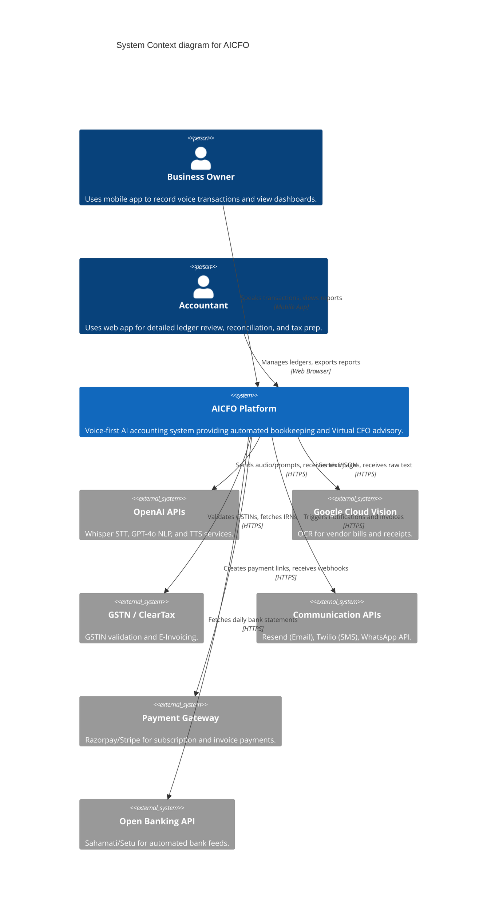
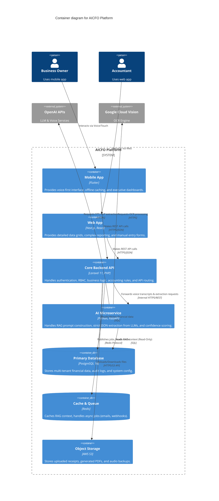

# Software Architecture Design (SAD)

---

# Part 1: High-Level System Architecture

---

## 1.0 Architectural Assumptions
Based on the approved Business Requirements Document (BRD) and best practices for the chosen tech stack (Laravel + Python + Next.js + Flutter), this architecture proceeds with the following foundational decisions:

1. **Multi-Tenancy:** Single shared PostgreSQL database utilizing a strict `tenant_id` column on all tenant-specific tables, enforced via Row-Level Security (RLS) or global ORM scopes in Laravel to guarantee data isolation.
2. **API Paradigm:** Standard RESTful JSON APIs using Laravel API Resources for frontend-backend communication.
3. **AI Communication:** Synchronous REST API communication between Laravel and the Python AI Microservice for real-time Voice-to-Text and NLP extractions, with Redis queues reserved for background tasks (e.g., OCR processing, batch reports).

---

## 1.1 Context Diagram (C4 Level 1)

The Context Diagram provides a macro view of the AICFO system, illustrating the users and external systems it interacts with.

---

## 1.2 Container Diagram (C4 Level 2)

The Container Diagram zooms into the `AICFO Platform` to show the distinct deployable units (containers) that make up the system, their responsibilities, and how they communicate.

---

## 1.3 Container Responsibilities

### 1. Flutter Mobile App (Frontend)
- **Primary Interface:** The main tool for Business Owners.
- **Key Features:** One-tap voice recording, instant transaction confirmations, highly visual KPI dashboards.
- **Offline Capability:** Queues voice notes locally if the network drops, syncing to the API Gateway when restored.

### 2. Next.js Web App (Frontend)
- **Primary Interface:** The main tool for Accountants and Tax Consultants.
- **Key Features:** Dense data grids (Ag-Grid or similar), manual journal entry forms, advanced filtering, and PDF/Excel report exports.

### 3. Laravel Core Backend (API Gateway & Logic)
- **The Source of Truth:** Enforces the "Fundamental Accounting Rules" and "Compliance Rules" defined in Chapter 7.
- **Responsibilities:**
  - JWT Authentication and Role-Based Access Control (RBAC).
  - Enforcing PostgreSQL Row-Level Security (`tenant_id`).
  - Double-entry journaling logic.
  - Generating PDFs for invoices and reports.
  - Acting as the gateway: It receives voice audio from Flutter, forwards it to the Python AI service, waits for the structured JSON response, applies accounting logic, and returns the result to Flutter.

### 4. Python FastAPI AI Service
- **The Brain:** Completely isolated from financial write operations to prevent hallucination-induced data corruption.
- **Responsibilities:**
  - Interfacing with OpenAI (Whisper, GPT-4o).
  - Executing Retrieval-Augmented Generation (RAG) by fetching active Chart of Accounts and Vendor lists from PostgreSQL to inject into prompts.
  - Calculating the "Confidence Score" for each extraction.
  - Interfacing with OCR engines (Google Vision) for receipt parsing.
  - **Constraint:** This service only has READ access to the database (to fetch context) and MUST return its findings to Laravel via API. It cannot INSERT journal entries directly.

### 5. PostgreSQL Database
- **Structure:** A single, robust relational database.
- **Why Postgres?** Excellent support for JSONB (crucial for storing flexible AI extraction metadata alongside rigid journal lines) and robust Row-Level Security features to ensure tenant isolation.

### 6. Redis (Cache & Queue)
- **Caching:** Stores frequently accessed RAG context (e.g., active COA list) to reduce database load during rapid AI prompt generation.
- **Queues:** Handles async tasks triggered by Laravel (e.g., sending email invoices, processing scheduled payment reminders, webhooks).
