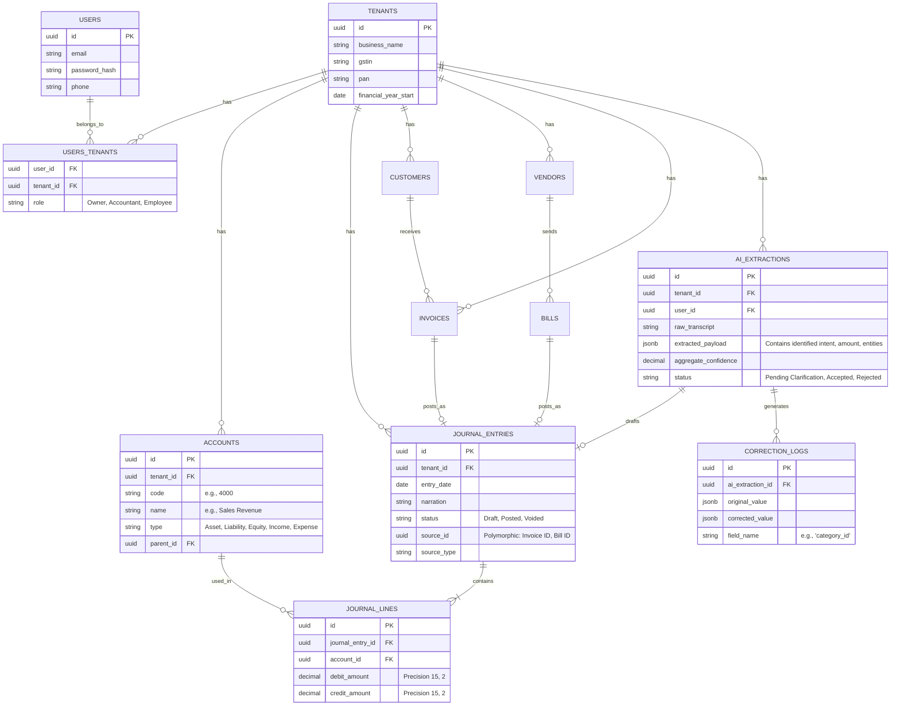

# Software Architecture Design (SAD)

---

# Part 2: Database Schema Design

---

## 2.0 Overview & Principles

The database schema is designed for PostgreSQL 16. It adheres to the following core principles:

1. **Strict Multi-Tenancy:** Almost every table (except global tables like `users`) includes a `tenant_id` foreign key. This allows for enforcing Row-Level Security (RLS) at the database layer to guarantee data isolation.
2. **Double-Entry Immutability:** Financial data is stored in a rigid `journal_entries` and `journal_lines` structure. Once posted, these rows are essentially immutable (enforced by application logic).
3. **AI Flexibility:** AI extraction metadata is stored in `JSONB` columns. This allows the system to store probabilistic data (confidence scores, raw transcripts) without polluting the rigid financial columns.
4. **Soft Deletes:** Tables contain `deleted_at` timestamps to preserve audit history and prevent broken foreign key references.

---

## 2.1 Entity Relationship Diagram (Core Modules)

The following diagram illustrates the relationships between the Core, Finance, Sales/Purchase, and AI modules.



---

## 2.2 Key Table Deep Dives

### 2.2.1 Core Accounting (`journal_entries` & `journal_lines`)
This is the heart of the system. **Every** financial event (Sales, Purchases, Payments, Depreciation) eventually resolves into a Journal Entry.

- `debit_amount` and `credit_amount` are stored as `DECIMAL(15,2)` to prevent floating-point rounding errors.
- The `source_id` and `source_type` utilize a polymorphic relationship. For example, if an invoice generates the entry, `source_type = 'App\Models\Invoice'` and `source_id = [invoice_uuid]`.

### 2.2.2 AI Extraction (`ai_extractions`)
This table acts as the bridge between the probabilistic AI and the deterministic ledger.

- **`raw_transcript`**: Stores exactly what the user said (e.g., "Paid 5k to Rajesh for rent").
- **`extracted_payload` (JSONB)**: Stores the structured output from the Python AI service. Example:
  ```json
  {
    "intent": "expense",
    "amount": 5000.00,
    "vendor_name": "Rajesh",
    "vendor_id": "uuid-here",
    "category": "Rent",
    "confidence_scores": {
      "amount": 1.0,
      "vendor": 0.95,
      "category": 0.88
    }
  }
  ```
- **`aggregate_confidence`**: Determines if this extraction stays in 'Draft' mode (requires human click) or auto-posts to `journal_entries` (if > 0.95).

### 2.2.3 ML Feedback Loop (`correction_logs`)
Crucial for fulfilling BRD Requirement **AI-MEM-001 (Correction Logging)**. 

If the AI suggests "Category: Office Supplies" with 0.88 confidence, and the Business Owner manually changes the dropdown to "Category: Repairs", the system logs this event. The Python AI service will periodically query this table (filtered by `tenant_id`) to inject these specific corrections into future RAG prompts for that user, ensuring the AI "learns."

---

## 2.3 Row-Level Security (RLS) Implementation Strategy

To guarantee **NFR-SEC-001 (Data Isolation)**, PostgreSQL RLS will be applied to all tenant-scoped tables via Laravel migrations.

Example Postgres Policy:
```sql
ALTER TABLE journal_entries ENABLE ROW LEVEL SECURITY;

CREATE POLICY tenant_isolation_policy ON journal_entries
    USING (tenant_id = current_setting('app.current_tenant_id')::uuid);
```
Laravel middleware will set the `app.current_tenant_id` session variable upon each request based on the authenticated user's active tenant context, ensuring data bleed is impossible at the database layer.
